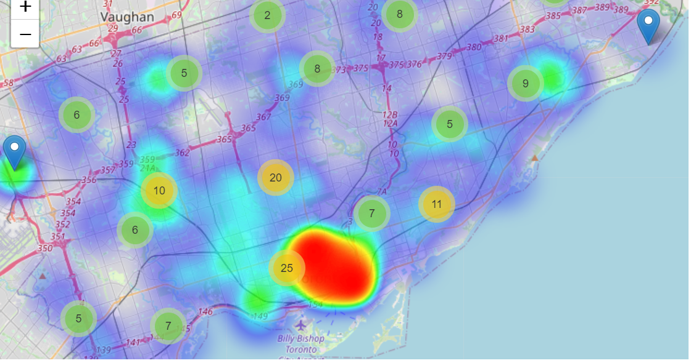

# CrimeAnalysisInNeighborhoodsOfToronto

This project was done as part of course CSCE676 Data mining and analysis.
Used the data from kaggle datasets.
Performed the EDA and implemented just K-Means clustering algorithm.
Future work is to use the FP-growth or associative mining techniques for frequent item-sets.

Project Website : https://sites.google.com/view/crime-analysis/home

## Abstract

When a crime is committed, the chances of catching the criminal drop exponentially with time. Thus, maintaining a low response time is a crucial factor, which is a bit tricky as it is reasonable to assume that the chances of catching a criminal increase when units or personnel trained or specialized in a particular type of crime are deployed to the crime scene where such a crime has taken place, and this is not easy without knowing which crime is likely to occur in which area. Our project aims to solve this problem.

## Motivation

This dataset includes all Major Crime Indicators (MCI) occurrences by reported date and related offences. The MCI categories include Assault, Break and Enter, Auto Theft, Robbery and Theft Over. This data is provided at the offence and/or victim level, therefore one occurrence number may have several records associated to the various MCIs used to categorize the occurrence. This data does not include occurrences that have been deemed unfounded. The definition of unfounded according to Statistics Canada is: “It has been determined through police investigation that the offence reported did not occur, nor was it attempted”

## Project Goal

To reduce the response time and also increase the efficiency of catching the criminal or the offender by deploying specialized units or specialized personnel trained in the specific crime that has been reported.

## Problem Statement

Identify groups of neighborhoods, all of which have similar types of crimes occurring at similar levels, to be able to deploy specialized units or specialized personnel in the vicinity of such neighborhoods to cut down on response time while also increasing the chances of catching the criminal or the offender more efficiently.

## Data Source

The dataset that we have selected for our project is the Toronto Police Dataset (Reports and files on Major Crimes and Locations), which is freely available for download from their official website at this [link](https://data.torontopolice.on.ca/).

Dataset - Toronto Police Dataset (Reports and files on Major Crimes and Locations)  

This data-set contains all instances of Major Crime Indicators (MCI) by reported date and related offenses. Assault, Break and Enter, Auto Theft, Robbery, and Extortion Over are among the MCI categories. Because this information is provided at the offender and/or victim level, one occurrence number may have many entries linked to the numerous MCIs used to categorise the occurrence. This information excludes incidents that were proved to be false. According to Statistics Canada, "it has been discovered via police investigation that the offence alleged did not occur, nor was it attempted" is the definition of unfounded.

**Dataset Size:** 206435 rows and 29 columns.  

  

## Exploratory Data Analysis

**Correlation Plot for MCIs**

  

**Frequency Distribution for the number of crimes reported for each of the premise types**

  

**Frequency Distribution for the number of crimes reported for each of the MCI types**

  

**Crime categories over years**

  

**Heatmap of the crimes over the area**

  

## Modeling  

**Clustering** a type of unsupervised learning is a way to group a set of data points into clusters based on some distance measure such that the data points belonging to the same cluster are closer to each other than the data points belonging to the other clusters based on the considered distance measure.

### K-Means Clustering
**K-Means** is one of the most popular “clustering” algorithms. It is the process of partitioning groups of data points into a small number of clusters. Using our crime data, as we measure the number of assaults and other indicators, the neighbourhoods with high numbers of assaults will be grouped together. The goal of K-Means clustering is to assign a cluster to each data point (neighbourhood). We first partition datapoints (neighbourhoods) into k clusters in which each neighbourhood belongs to the cluster with the nearest mean (serving as a prototype of the cluster).

As one of the unsupervised learning algorithms,we use K-Mean to build models that help us understand our data better. It enables us to group unlabeled data points.

### Steps to Perform K-Means Clustering
    1. Choose the number of K clusters.
    2. Select K random points from the data as centroids.
    3. Assign all points to the closest cluster centroid.
    4. Recompute the centroids of newly formed clusters.
    5. Repeat Steps 3 and 4.

### Stopping Criteria for K-Means Clustering
There are essentially three stopping criteria that can be adopted to stop the K-means algorithm:

    1. Centroids of newly formed clusters do not change.
    2. Points remain in the same cluster.
    3. Maximum number of iterations are reached.

Selecting an optimal K-value for K-means clustering using the **Elbow Method**.  

In the Elbow method, we vary the number of clusters ( K ) from between some values. For each value of K, we calculate WCSS ( Within-Cluster Sum of Square). WCSS is the sum of the squared distance between each point and the centroid in a cluster. When we plot the WCSS with the K value, the plot looks like an Elbow. As the number of clusters increases, the WCSS value will start to decrease. When we analyze the graph we can see that the graph will rapidly change at a point and thus creating an elbow shape. From this point, the graph starts to move almost parallel to the X-axis. The K value corresponding to this point is the optimal K value or an optimal number of clusters.  

  

Applying the elbow method to the dataset, we got the optimal value of cluster to be k=4.

By using the optimal value of k=4, we used the K-Means algorithm from sklearn and divided the neighborhoods into four clusters.

## Results
The clusters are plotted on the geo map which can be seen as shown in the figure.

  

  

The 4 clusters are color-coded with the colors red, green, blue, and orange to give a good visual representation.

The resulting clusters of neighborhoods each represent a set of neighborhoods each of which has similar type of crimes occurring at similar levels.

The information from neighborhood clusters can be used to deploy specialized patrol units close to the neighborhoods belonging to a particular cluster, with similar type of crimes occurring at similar levels to reduce the response time and increase crime clearance rate.

Although we deploy specialized units or personnel, there may be unaccounted obstacles that might prevent the units from responding to the crime with a low response time.

## Future Scope:

Given a larger dataset containing more values for each of unique crimes, we can do frequent itemset mining with most crime types occurring in a location as items and the locations as baskets. This frequent item-sets can then be used in our K-means model to find the clusters of neighborhoods specific to the frequent item-sets of crimes.
